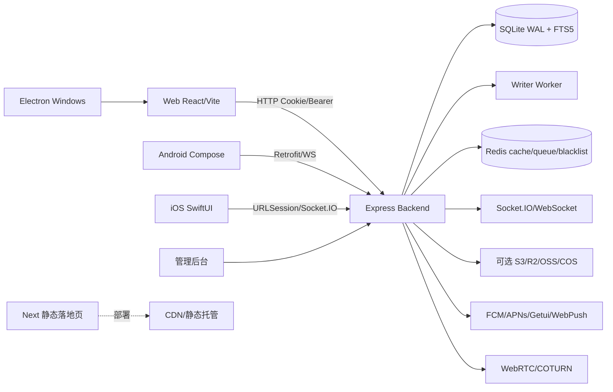

# 《投聊全项目深度审计报告》

审计分支：`audit/gpt-full-review`  
审计范围：Web、后端、桌面 Electron、Android/iOS 源码、落地页、管理后台、CI/CD、数据库/缓存/实时通信。所有运行服务均使用隔离端口、临时 SQLite、临时上传目录和临时 Redis；未连接生产数据库，未读取或输出真实密钥。

## 1. 当前健康度

综合评分：**72/100**。核心聊天路径可以运行，后端测试和 Web 构建稳定，但实时会话失效、同步隐私、确认接口权限、上传并发和生产构建依赖仍需处理后再上线。

| 维度 | 评分 | 依据 |
|---|---:|---|
| 架构 | 78 | 模块边界、SQLite WAL、事件游标、缓存和多端客户端较完整；写入 worker、Redis 多实现和历史兼容层增加复杂度 |
| 代码质量 | 70 | Web/后端测试覆盖广，但覆盖率中等，存在超大组件、旧测试空壳和重复基础设施 |
| 稳定性 | 68 | 已修复若干会话/WS失效问题；上传竞态、worker 重放和 ACK 权限仍有风险 |
| 性能 | 75 | Web 首屏实测 FCP 428ms、LCP 984ms、CLS 0.00022；性能基准为小数据集，不能代表高并发 |
| UI | 76 | 登录、注册、聊天、移动尺寸实测无明显错位；完整原生端视觉回归受 Linux 环境限制 |
| UX | 74 | 核心聊天发送、Emoji、离线恢复、图片选择可用；错误/空状态和多端恢复仍需统一 |
| 安全 | 65 | 本轮已修复高影响会话和同步问题；ACK 越权、DLQ 暴露、上传并发和代理 IP 仍需修复 |

问题统计：P0 **0**；P1 **20（10 已修复，10 待修复）**；P2 **9（2 已修复）**；P3 **若干优化项**。数量按本轮确认的独立问题计，不把同一根因在不同端重复计数。

## 2. 架构关系

主要调用链：登录由客户端 Axios/原生 API → `/api/auth/login` → `auth.service` → SQLite `users/user_sessions` → JWT+Cookie；聊天发送由 ChatWindow/原生 ViewModel → HTTP 或 Socket handler → `messages.service` → writer/event sequence → Socket.IO 广播；重连由 SocketProvider → `/sync` 游标 → IndexedDB/本地消息排序；文件由 upload-init → 分块 PUT → finish → 本地/S3 对象存储。

## 3. 已修复

- `backend-v2/src/modules/auth/auth.service.js`：会话撤销增加 user ownership 校验；批量踢出改为精确拉黑被删 session，不再把当前 token 一并判为密码旧 token；iPhone/iPad UA 在 Mac 兼容字符串前识别。
- `backend-v2/src/modules/auth/auth.controller.js`：refresh 返回新 Bearer token；删除会话等待异步黑名单完成；退出登录主动断开该用户 Socket。
- `backend-v2/src/middleware/auth.js`：JWT 对应用户不存在时返回 401，不再把已删除用户当作有效用户。
- `backend-v2/src/realtime/index.js`：畸形 Cookie 编码 fail-closed；Token 到期自动断开 idle Socket；兼容测试桩没有 `once` 的情况。
- `backend-v2/src/modules/messages/sync.service.js`：按用户清空水位和个人删除水位隐藏消息，撤回消息的历史编辑 payload 脱敏，仍推进游标。
- `backend-v2/src/modules/conversations/conversations.service.js`：已读消息使用 SQLite rowid 顺序而不是 UUID 字符串比较；拒绝不属于会话的 messageId；已读水位不回退。
- `web/src/utils/axiosInterceptor.js`：refresh 后显式替换原请求 Authorization；自动重试限定 GET/HEAD/OPTIONS，避免非幂等 POST、转账、上传在响应丢失时重复提交。
- 新增 `backend-v2/test/audit-session-sync.test.js`，覆盖会话越权、refresh、清空/删除/撤回同步、读回执、logout、畸形 WS Cookie、过期 Socket、批量踢出和移动 UA。

## 4. 待修复问题清单

### P1

1. **确认接口缺少会话成员校验**（后端，`backend-v2/src/routes/reliability.routes.js:34`、`:73`、`:118`）。任何已登录用户知道 messageId 即可伪造送达/已读，且 status 可观察别人的 ACK。复现：用户 B POST `/api/reliability/ack/read` 使用不属于其会话的 messageId，当前直接 200。根因是只校验 `req.user`，未查询 `conversation_members`。立即修复：统一 `requireMessageMember(messageId,userId)`，delivery/read/status/batch 全部调用。
2. **死信队列和队列统计对普通用户开放**（`reliability.routes.js:150-188`）。可枚举 queueName 并读取 DLQ payload，可能泄露消息、内部错误和对象 URL。应改为 adminAuth 或独立运维权限。
3. **反向代理下 WebSocket IP 限流使用 socket.handshake.address**（`backend-v2/src/realtime/index.js:70`）。真实用户都可能被归为 Nginx 地址，30 次/分钟会互相影响；任意未受信任 X-Forwarded-For 的处理也可能绕过。应使用受信代理解析后的地址并在边缘层限流。
4. **分块上传同 offset 并发写入可能损坏文件**（`backend-v2/src/modules/upload/chunk.js`，由 `messages.routes.js:979-982` 暴露）。offset 检查和 appendFile 之间没有 per-upload lock；两个 PUT 可同时通过。应采用临时分片文件按 offset 命名、O_EXCL/锁和 finish 时连续性校验。
5. **密码变更后 device_accounts 免密切换授权未撤销**（`auth.service.js:283-310`、`:260-278`）。旧设备钱包记录仍可重新签发新 JWT。密码变更、注销、管理员强制下线应清除或版本化该授权。
6. **Writer worker 重放没有通用幂等保证**（`backend-v2/src/db/writer.js`）。事务提交后进程在 ACK 前崩溃会重复执行 INSERT/计数更新；失败队列使用 unshift 还可能反转顺序。应为写操作增加 operation id、结果表和重放前检查。
7. **未读数仍主要依赖秒级 last_read_at**（`conversations.service.js:216-246,329-344`）。同一秒的消息可能被错误计为已读或漏计；应全面使用 server_sequence/rowid 水位，和本轮 message_reads 修复保持一致。
8. **消息 HTTP 发送缺少统一 client_msg_id 幂等契约**（`messages.service.js` send 路径）。网络响应丢失后客户端无法安全重试，和 Socket 端去重语义不一致。应要求非空 client_msg_id 并建立 `(conversation_id, sender_id, client_msg_id)` 唯一约束或等价幂等表。
9. **实时 Socket 事件鉴权只在发送事件触发**（`realtime/index.js:141-173`）。本轮已增加 exp 定时器，但删除会话/封禁等状态仍依赖事件或主动断开；所有管理状态变更都应通过 user room 主动断开并保留 Redis pub/sub 广播。
10. **桌面 Windows 发布默认要求私钥，构建门禁未在 CI 前置验证**（`desktop-electron/scripts/run-electron-builder.js`）。审计构建在签名阶段失败；不能用真实密钥绕过。CI 应在打包前显式检查签名材料并给出清晰失败原因。

### P2

- `/api/metrics/vitals/recent` 无鉴权（`backend-v2/src/app.js:345-363`），返回 URL、UA 和时间；应只对管理员开放或只返回聚合数据。
- WebV ուitals 只在客户端上报，缺少采样、租户隔离和保留策略；高流量时内存环形缓冲仍是单实例数据。
- Web 首包 vendor-react gzip 约 109KB，PDF worker 约 366KB、PDF/XLSX lazy chunk 较大；可继续按功能拆包和按需加载。
- `web/src/index.css`、`I18nContext.jsx`、`ChatWindow.jsx` 等超大文件增加回归成本，应分解主题、翻译和消息渲染职责。
- 后端覆盖率语句 57.51%、分支 44.76%，虽高于门槛但核心权限分支仍缺少系统化 API 矩阵。
- Android 构建在当前环境因无 Java/Android SDK 无法执行；iOS 因 Linux 无 Xcode 无法执行，不能据此宣称移动端发布通过。
- Electron 依赖 Electron 30 已有审计告警；应结合实际运行面和升级兼容性制定升级窗口，不建议直接 `npm audit fix --force`。
- landing 使用 Next 14.2.5 静态导出；服务端 RSC/中间件类告警在当前静态部署不可直接等同于线上可利用，但仍应安排升级验证。
- 测试脚本使用 `--forceExit`，可能掩盖未关闭句柄；应在 CI 增加一次不带 forceExit 的 handle 检查。

## 5. 验证结果

| 检查 | 结果 |
|---|---|
| Web lint | 通过，0 warning |
| Web 单测 | 16 文件、116 项通过 |
| Web 生产构建 | 通过 |
| 后端完整测试 | 98 套件通过，746 项通过，1 项原有 skip |
| 后端覆盖率 | 行 60.56%，语句 57.51%，分支 44.76%，函数 52.31% |
| 后端性能基准 | 8 项通过；小数据集并发读/写和热缓存基准通过 |
| Landing type/build | 通过 |
| 浏览器核心流程 | 登录、聊天、Emoji、离线恢复、图片选择、390px 无横溢通过 |
| 浏览器性能 | FCP 428ms，LCP 984ms，CLS 0.00022；长任务约 55–83ms |
| Windows | 安装和 Electron 下载成功；签名私钥门禁失败，未伪造签名 |
| Android | 环境缺 Java/SDK，未跳过并伪报通过 |
| iOS | 环境无 Xcode，未跳过并伪报通过 |

## 6. 路线图

立即修复：ACK/读回执成员鉴权、DLQ 管理员鉴权、分块上传并发锁、device_accounts 密码变更撤销、未读 server_sequence 水位、HTTP 消息幂等键。

24 小时内：修复代理 IP 限流、公共 vitals 访问、CI 签名前置检查；跑 Redis 开启模式下的全量回归和不带 forceExit 的句柄检查。

7 天内：拆分 ChatWindow 与消息同步模块；建立 Web/Windows/Android/iOS 统一错误、重连、通知和 token 状态协议；增加弱网、网络切换、多设备冲突 E2E。

30 天内：Writer 操作幂等表和可观测重放；消息列表虚拟化压力测试；对象存储断点续传和病毒/内容类型策略；Android/iOS 真机启动、ANR、OOM、后台恢复测试。

长期：引入跨实例 Socket 状态广播、独立消息存储/归档策略、容量基准和 SLO；依赖按安全公告和兼容性窗口升级。

## 7. 最值得优先优化的 TOP 20

1. ACK/已读成员鉴权；2. DLQ 管理员权限；3. 分片上传并发一致性；4. HTTP 消息幂等键；5. 未读 server_sequence 水位；6. device_accounts 撤销；7. Writer 幂等重放；8. 代理真实 IP 限流；9. 跨实例 Socket 失效广播；10. 无 forceExit 句柄检查；11. Android 真机基线；12. iOS 真机基线；13. Windows 签名 CI 门禁；14. ChatWindow 拆分；15. 消息历史压力测试；16. 图片/视频压缩与首帧缓存；17. PDF worker 分包；18. 统一 Toast/Loading/空状态；19. 通知与角标多设备一致性；20. 依赖安全升级窗口。

本报告不代表 Android/iOS/Windows 发布验收已经完成：当前环境分别缺少 Android SDK/JDK、Xcode 和生产签名材料，相关结论已明确标注为环境阻塞。
