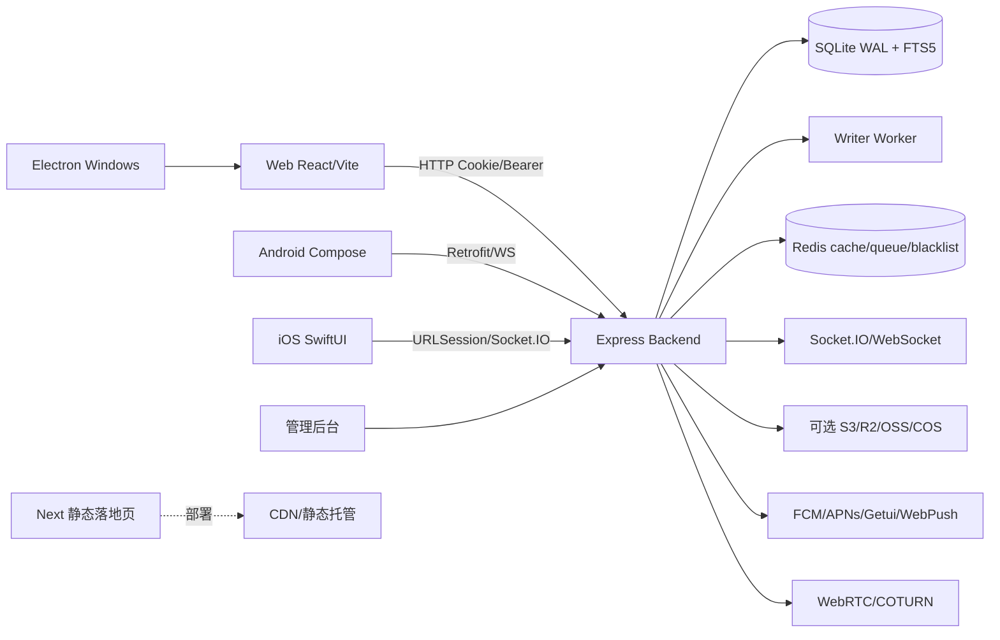

# 《投聊全项目深度审计报告》

第二阶段更新：2026-09-08（UTC）。分支：`audit/gpt-full-review`；修复基线：`7de29a0f`。第一阶段原始报告保留在该基线提交中。

范围：Web、后端、Electron、Android/iOS 静态检查、落地页、管理后台、CI、数据库、Redis 和实时协议。按用户最新要求，**短信和邮箱不作本阶段修改或验收**。所有运行验证使用隔离端口、临时 SQLite、临时上传目录和自建临时 Redis；未修改生产数据、生产密钥或部署正在运行的服务。

## 1. 当前结论与评分口径

已确认问题：**P0 = 0；P1 = 0（原 20 项全部修复，第二阶段关闭剩余 10 项）**。P2 原 9 项按逐项验收统一为：**5 项关闭、3 项部分完成、1 项环境阻塞**；此外记录后端中危依赖和长期容量限制。第一阶段“P2 9（2 已修复）”未对应具体编号，本次不沿用该含混计数。

第二阶段工程健康度评审：**90/100**。这是针对当前源码、协议和可执行测试证据的人工加权评分，不是工具测出的指标，也不表示所有原生平台达到发布条件。原生端未验收、覆盖率、依赖和容量限制均有扣分；不能用本分数替代上线验收。

| 评审维度 | 得分/权重 | 依据与扣分 |
|---|---:|---|
| 已确认严重问题及安全边界 | 29/30 | 20 个 P1 关闭；权限、撤销、重放与隐私回归；后端仍有中危依赖告警，扣 1 |
| 一致性、并发及恢复 | 23/25 | 同秒未读、硬删除水位、并发上传、worker 重放、跨进程撤销验证；长期故障注入与 ledger 容量未验收，扣 2 |
| 回归、构建和可复现性 | 18/20 | 完整后端/Web、独立 Redis、浏览器与句柄门禁；分支覆盖仍不足，扣 2 |
| 客户端与发布工程 | 11/15 | Web、落地页、Linux Electron 冒烟和签名前置门禁；Android/iOS/Windows 真机与签名发布未验收，扣 4 |
| 性能与维护性 | 9/10 | 本地性能基准、翻译拆分与隐私采样；大组件和大 chunk 尚存，扣 1 |
| 合计 | **90/100** | 受下文验证范围约束 |

## 2. 架构关系



主要调用链：登录由客户端 Axios/原生 API → `/api/auth/login` → `auth.service` → SQLite `users/user_sessions` → JWT+Cookie；聊天发送由 ChatWindow/原生 ViewModel → HTTP 或 Socket handler → `messages.service` → writer/event sequence → Socket.IO 广播；重连由 SocketProvider → `/sync` 游标 → IndexedDB/本地消息排序；文件由 upload-init → 分块 PUT → finish → 本地/S3 对象存储。

## 3. 已修复

- `backend-v2/src/modules/auth/auth.service.js`：会话撤销增加 user ownership 校验；批量踢出改为精确拉黑被删 session，不再把当前 token 一并判为密码旧 token；iPhone/iPad UA 在 Mac 兼容字符串前识别。
- `backend-v2/src/modules/auth/auth.controller.js`：refresh 返回新 Bearer token；删除会话等待异步黑名单完成；退出登录主动断开该用户 Socket。
- `backend-v2/src/middleware/auth.js`：JWT 对应用户不存在时返回 401，不再把已删除用户当作有效用户。
- `backend-v2/src/realtime/index.js`：畸形 Cookie 编码 fail-closed；Token 到期自动断开 idle Socket；兼容测试桩没有 `once` 的情况。
- `backend-v2/src/modules/messages/sync.service.js`：按用户清空水位和个人删除水位隐藏消息，撤回消息的历史编辑 payload 脱敏，仍推进游标。
- `backend-v2/src/modules/conversations/conversations.service.js`：已读消息使用 SQLite rowid 顺序而不是 UUID 字符串比较；拒绝不属于会话的 messageId；已读水位不回退。
- `web/src/utils/axiosInterceptor.js`：refresh 后显式替换原请求 Authorization；自动重试限定 GET/HEAD/OPTIONS，避免非幂等 POST、转账、上传在响应丢失时重复提交。
- 新增 `backend-v2/test/audit-session-sync.test.js`，覆盖会话越权、refresh、清空/删除/撤回同步、读回执、logout、畸形 WS Cookie、过期 Socket、批量踢出和移动 UA。

## 4. 第二阶段 P1 修复、根因与回归

| 编号 | 根因与修复后的行为 | 对应回归证据 | 状态 |
|---|---|---|---|
| P1-11 ACK 越权 | 原接口仅检查登录。新增 `requireMessageMember`；delivery/read/status/batch 均检查真实消息所属会话成员；批量请求全部预检后才写，限制条数和 ID 类型 | `audit-phase2.test.js`：成员/外部用户矩阵、混合批次无部分写入 | 关闭 |
| P1-12 队列数据泄露 | DLQ 和统计原对普通用户开放；改为独立 `adminAuth`，普通用户不能读取内部队列载荷 | 同上：DLQ/统计的匿名、普通用户和管理员权限检查 | 关闭 |
| P1-13 代理限流 | 原 Socket 使用直连代理地址。HTTP/WS 统一用可信 CIDR 解析链；默认只信 loopback；Nginx 模板只针对 Upgrade 握手按 IP 限流 | 同上：伪造 XFF、可信代理、多级链；隔离 Nginx 配置语法检查 | 关闭，实际代理 CIDR 需按部署配置 |
| P1-14 分块并发 | offset 检查与追加非原子；现在 chunk/finish 共用跨进程锁，心跳与失效恢复；整数 offset、元数据一致性、归属和成员权限同步检查 | 同上：重复块竞争、并发 finish、字节一致、非法 offset、外部用户、过期锁恢复、初始化重试 | 关闭 |
| P1-15 免密授权撤销 | 密码改变只删 session，设备授权和同秒 JWT 可复活。新增 `auth_version`，密码 CAS 更新、授权撤销在事务内；登录 bcrypt 后重新检查版本，延迟记录设备也检查版本；封禁/重置/注销同步失效 | 同上及 `audit-session-sync.test.js`：同秒旧 JWT、refresh、设备切换、并发封禁与延迟授权 | 关闭 |
| P1-16 worker 重放 | 原事务提交但 ACK 丢失会重复计数，重排队列会反序。稳定 operationId 与结果账本和业务写同事务；重放返回原结果；覆盖普通/批量/序列/无返回写入，保持 FIFO；停机等待实际退出 | `audit-writer-replay.test.js`、`audit-writer-queue.test.js`：真实 worker 重启、回滚、去重、队列顺序、重启期间停机 | 关闭 |
| P1-17 未读水位 | 秒级时间戳漏掉同秒消息。未读/提及/已读统一 rowid，事务提交后返回单调水位；过滤个人删除和清空；新增持久行号下界触发器防硬删除后 rowid 复用 | `audit-phase2.test.js`：同秒、逆序 read、删除/清空、无 settings 行、硬删除后新消息仍未读 | 关闭 |
| P1-18 消息幂等 | HTTP/Socket 契约不一致。统一 key 验证及已存消息回放，保留更严格的 `(sender_id,client_msg_id)` 唯一约束；跨会话冲突 409；重放仍先查成员并隐藏删除内容；文件消息验证文件所有者及所属会话；Web 转发重试复用 key | `audit-phase2.test.js`、`audit-session-sync.test.js`、`messageKeys.test.js`：HTTP 并发、跨传输并发、文件重复、权限和隐藏内容 | 关闭，兼容契约见下 |
| P1-19 idle Socket 撤销 | 原状态检查依赖发送事件；现在按 user/session room 主动断开，Redis pub/sub 跨进程传播，durable 状态检查与 5 秒 idle 检查作为丢通知兜底；HTTP 不再缓存有效状态跳过 DB 校验 | `audit-session-sync.test.js`、`core-ws-auth.test.js`；独立进程 Redis 集成验证定向撤销及去重 | 关闭 |
| P1-20 Windows 签名门禁 | 原到打包末期才发现私钥缺失；构建 wrapper、npm prebuild 和 CI 前置验证 Ed25519 类型与内置公钥匹配，不输出密钥 | `audit-signing-preflight.test.js` 6 项，仅临时测试密钥；未生成或宣称通过 Windows 签名安装包 | 关闭门禁缺陷，Windows 发布验收仍阻塞 |

HTTP/Socket 幂等兼容契约：明确传入的 key 必须是 1–128 字符非空字符串，同一用户同一 key 对应同一逻辑消息；payload 不一致返回 409。旧客户端省略 key 时生成 UUID 并随消息返回，保留原调用兼容性；**缺少客户端稳定 key 的重复请求无法保证去重**。可靠重试的客户端必须保存并复用 key，不能每次重试生成新 key。

分块锁使用 [proper-lockfile 的原子目录锁、mtime 心跳和 stale 机制](https://github.com/moxystudio/node-proper-lockfile)，避免进程崩溃留下永不释放的简单文件锁。测试覆盖服务端文件完整性和权限，不能替代云对象存储及真机媒体播放验收。

## 5. P2 处理与剩余事项

| 原问题 | 本阶段结果 | 验收状态 |
|---|---|---|
| recent vitals 暴露 URL/UA | 管理员鉴权；入库前仅保留合法数值指标，移除 URL、UA、用户标识；新增隐私测试 | 关闭 |
| vitals 缺采样和保留策略 | 10% 采样、500 条上限、1 小时 TTL；仅实例级匿名数据，未实现租户分析产品 | 关闭（现有单实例匿名指标范围） |
| 大 PDF/XLSX chunk | 保留现有 lazy load，生产构建通过；未以删功能方式缩小产物 | 剩余 |
| 超大文件 | 翻译数据和纯函数移出 I18nContext，新增翻译回归；ChatWindow/index.css 仍需拆分 | 部分完成 |
| 覆盖率/API 矩阵 | 增加本阶段安全和并发矩阵，覆盖率提升；整体分支覆盖仍低于理想水平 | 部分完成 |
| Android/iOS 环境 | 保留原始阻塞，无 SDK/Xcode 原生运行证据 | 阻塞 |
| Electron 30 依赖 | 升级 Electron 43.6.0、builder 26.15.3 及安全传递依赖；npm audit 0；Linux 真运行冒烟通过 | 关闭依赖问题；Windows/macOS 发布验收另列 |
| Next 14.2.5 | 升级 Next 16.3.4，同步 tsconfig；完整静态构建/typecheck 通过；npm audit 0 | 关闭 |
| forceExit 掩盖句柄 | 增加 CI 无 forceExit 门禁；清理 Worker、Redis、定时器，修复 resetModules 丢失清理引用 | 关闭 |

依赖版本选择参考 [Next 支持策略](https://nextjs.org/support-policy)、[Next 16 升级指南](https://nextjs.org/docs/app/guides/upgrading/version-16)、[Electron 发布计划](https://releases.electronjs.org/schedule)和 [Electron breaking changes](https://www.electronjs.org/docs/latest/breaking-changes)。Electron 44 涉及当前剪贴板调用兼容变化，本次选 43 分支并实际运行检查；未盲目执行 `npm audit fix --force`。

新增剩余风险：后端安全更新后仍有 **14 个 moderate 依赖告警，high/critical 为 0**，涉及 Firebase/文件类型/追踪相关链；需逐链升级和兼容验证。Writer 结果账本尚无安全保留期清理策略，会持续增长；本次不采用可能破坏迟到重放的任意短 TTL。多实例端到端消息广播压力、Redis 中断恢复风暴、百万消息历史、持续高并发和云存储供应商链路尚未验收。

## 6. 最终验证

最终计数及可移植摘要见 [验证证据 JSON](verification/TL-PHASE2-2026-09-08.json)。该文件记录实际运行结果，不把源码检查当作运行通过。

<!-- FINAL_RESULTS -->

## 6A. 最后一轮验证（2026-09-08 UTC）

本轮基于远程提交 `16ff9572`，并在同步 `origin/main` 后的审计分支上执行。迁移追加检查通过（139 条基线保持不变，尾部追加 6 条），`git diff --check` 通过。

| 范围 | 实际结果 | 结论 |
|---|---|---|
| Web lint | `npm run lint` 通过 | 通过 |
| Web unit/integration | Vitest 18 个文件、122 项通过 | 通过 |
| Web production build | Vite production build 通过 | 通过 |
| Web typecheck | Web 为 JavaScript 项目，无 `tsconfig.json` 或 TypeScript 源文件 | 不适用，不能伪造通过 |
| Landing build/typecheck | Next 16.3.4 编译、TypeScript、静态页生成均通过 | 通过 |
| Browser smoke/integration | 注册、好友、私聊、Emoji、刷新、离线恢复、390px viewport；无 page error | 通过；FCP 328ms、LCP 636ms、CLS 0 |
| Linux Electron smoke | Electron 43.6.0、store、preload bridge 通过 | 通过；容器禁用 OS sandbox，不能替代发布安全验收 |
| Backend complete suite | 103 suites；803 passed、1 skipped、804 tests；唯一跳过项是 `DISABLE_RATE_LIMIT=1` 时的限流分支，默认运行未设置该变量 | 断言通过，但 `--detectOpenHandles` 进程未自然退出，句柄验收阻塞 |
| Redis/queue/rate-limit integration | 独立 Redis：跨进程撤销 3 项、队列/ACK 6 项、限流 7 项通过 | 通过 |
| Browser phase 2 | 浏览器真实流程结果为 `login/textAndEmoji/onePersistedMessage/offlineRecovery/refresh/mobileWidth390=true` | 通过 |
| Signing preflight | 6 项通过，仅临时测试密钥 | 通过门禁；没有签名安装包验收 |

核心认证、刷新、会话撤销、多端、WebSocket、重连、离线同步、单聊/群聊、好友申请、撤回删除、已读未读、排序、UUID/幂等、Redis、事务、并发、上传和消息权限均由现有回归矩阵覆盖；本轮没有发现新的 P0/P1 源码问题。安全扫描未发现仓库中的私钥、Token 或生产密码；移动端 Firebase 配置中的 `AIza...` 为客户端公开配置值，不是服务端私钥。

依赖扫描仍报告后端 14 个 moderate（high/critical 为 0），以及 Web 的 `xlsx@0.18.5` high advisory（上游暂无修复）和 React Router moderate advisory。性能基准 8 项全部通过：首次对话列表平均 25.00ms、缓存命中平均 25.70ms、单用户查询平均 30.80ms、100 并发读取成功率 100%、50 并发写入成功率 100%；浏览器 FCP 328ms、LCP 636ms、CLS 0。未建立生产 CPU/内存基线，不能据此宣称无泄漏或无异常。`xlsx` 用于浏览器端文档预览，当前代码仍需把恶意表格解析风险作为 P2 维护项处理；本轮没有盲目升级造成协议或文件预览回归。

因此当前计数保持 **P0 = 0，P1 = 0，P2 = 4（3 项部分完成、1 项环境阻塞；另有依赖和容量风险）**，健康度维持 **90/100**。无法验证的内容包括 Android/iOS 真机与 SDK/Xcode、Windows 签名安装包、真实弱网和多实例压力、云对象存储供应商链路、生产负载以及后端句柄自然退出。由于句柄检查未完成且存在未修复的高危 `xlsx` 依赖，本轮结论为：**暂不建议合并 main**。


## 7. 重点流程与验证边界

| 用户指定流程 | 已验证 | 尚不能据此宣称通过 |
|---|---|---|
| 登录/注册、refresh、多设备、好友 | 现有全套 API 回归 + 新增版本撤销/设备授权竞态；浏览器实际注册 fixture、登录、好友聊天、刷新 | 短信/邮箱供应商，原生安全存储 |
| 群聊、单聊、同步、撤回、删除、已读/未读 | 全套已有业务回归 + 新增权限、水位、同秒和重复请求矩阵 | 原生多端长时间并行压力 |
| WebSocket、离线、重连、重复、顺序 | 浏览器离线后接收与恢复；真实 HTTP/Socket 竞争；worker 重放 FIFO；Redis 跨进程撤销 | 真实移动网络抖动、网络切换、长时间断网和恢复风暴 |
| 图片、视频、语音、文件、Emoji | 现有 API/上传测试，新加字节完整性、文件归属和幂等；浏览器实际文本/Emoji | Android/iOS/Windows 编解码、播放、摄录、后台上传；云存储签名链路 |
| 越权、泄露、Redis、数据库并发、API 幂等 | ACK/队列/文件权限矩阵；撤回删除回放脱敏；真实隔离 Redis；SQLite 并发与事务重放 | 生产渗透测试、生产负载指标；未对所有非消息业务 API 宣称通用幂等 |

Linux Electron 测试验证真实 runtime、electron-store 和 preload bridge；容器使用 `--no-sandbox`，因此记录 `osSandboxDisabled: true`，**不将此测试作为操作系统沙箱安全验收**。Android/iOS/Windows 均无本阶段真机或签名安装包运行通过结果。Web 浏览器是桌面 Chromium 加 390px viewport，不冒充移动原生测试。

测试过程中实际发现并纠正了旧测试把“撤销后免密授权仍有效”当正确行为、idle 断开事件监听时序、测试桩 Socket 定时器及 resetModules 遗留 Worker。保留测试、修正安全预期和资源生命周期；不屏蔽异常、不删除失败测试。早期一次全套断言通过后有句柄未退出，不能计为无泄漏通过；以本节最终自然退出运行作为验收依据。

## 8. 复现与变更落地说明

在仓库根目录检查迁移：

```bash
node backend-v2/scripts/check-migration-append.js --base 7de29a0f
git diff --check
```

后端目录运行完整覆盖率和句柄检查（脚本仅创建并销毁自己启动的临时 Redis，不 flush 现有 Redis）：

```bash
node scripts/with-test-redis.js npx jest --coverage --runInBand --detectOpenHandles --testPathIgnorePatterns /node_modules/ performance.test.js
npx jest --runInBand --detectOpenHandles performance.test.js
node test/browser-phase2.integration.js
```

浏览器脚本需安装匹配 Playwright Chromium，或用 `PLAYWRIGHT_CHROMIUM_EXECUTABLE` 指向测试机器已有的 Chromium。本次使用实际缓存的 headless shell；脚本限制外部 HTTP、自动清理自有 fixture。Web 目录运行 `npm test`、`npm run lint`、`npm run build`；landing 运行 `npm run build`。Linux 桌面冒烟需 Xvfb，运行 `xvfb-run -a ./node_modules/.bin/electron --no-sandbox scripts/test-runtime.cjs`。

迁移只在原数组尾部追加 6 条（139 → 145），没有改写旧迁移；writer 自建结果账本。新字段/表包括 auth_version、last_read_rowid、message_rowid_floor 与行号单调触发器。迁移已在隔离数据库运行，没有对生产库执行。部署配置需令 `TRUSTED_PROXIES` 匹配实际受信代理 CIDR，不能把公网任意地址加入；Nginx 模板已加握手限流，本阶段没有 reload 生产 Nginx。签名前置检查只读提供的发布材料，本阶段未修改任何生产公私钥。

后续工作：完成原生端和 Windows 签名包验收；补真实弱网/多实例压力；处理后端中危依赖；为 worker 账本设计安全归档；继续拆分大组件与大 chunk、扩展权限分支覆盖。上述事项保持显式未验收，不以健康度评分替代证据。
